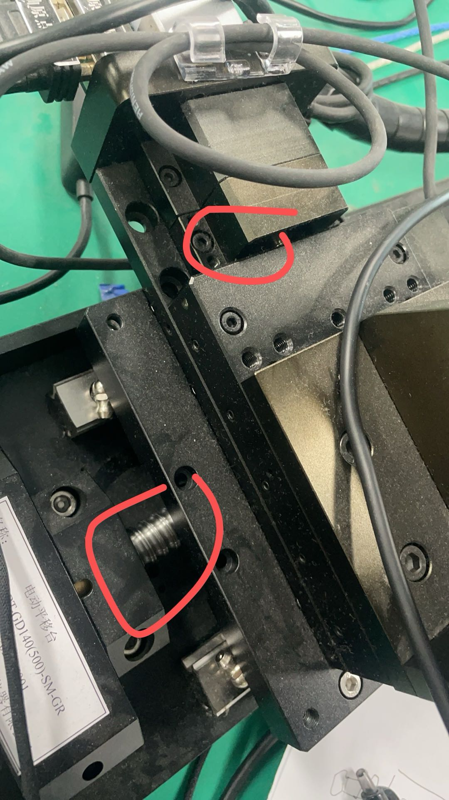

## 随时准备按下急停


然后尽量开始前先调零，但每次调零时旋转台都是同一个方向，很可能会扯到线，如果马上要扯到的话拆下来先把线清理一下
量程： x:
```bash
roecore
source ~/catkin_ws/devel/setup.bash
cd ~/Desktop/Pycharm/pycharm-community-2024.1.4/bin
./pycharm.sh 
```
open /home/xulab10/catkin_ws/src/sri-force-sensor ,
then run `gs_node.py`
open /home/xulab10/catkin_ws/src/gelsight_mini_ros ,
then run `sensor_node.py`

在运行一个程序让stage运行长程的时候突然kill有可能导致stage丢失零点，这样导致环境内硬编码的位置错误，超级有可能导致硬件损坏，所以一旦发现这种情况，先运行
[stage_motion_debug.py](stage_motion_debug.py)下的`stage.seek_and_set_zero()`,然后等待归零，我们的stage归零应该是：


然后peg_insertion运行是自动的，换一下cfg路径即可
传感器的线容易坏


11.22、重新调整：

gelsihtmini还是会松动 导致kill

# Ours
## 1. get the position information about the X/Y/Z axis
```
python control/get_info.py
```
## 2. go to the home position
```
python control/home.py
```
## 3. control X/Y/Z axis to the incremental position with specific speed
```
python control/move.py
```


